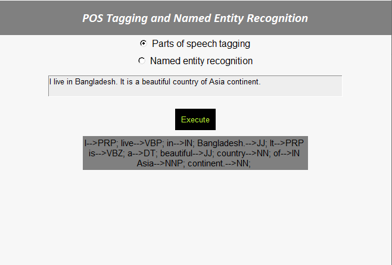
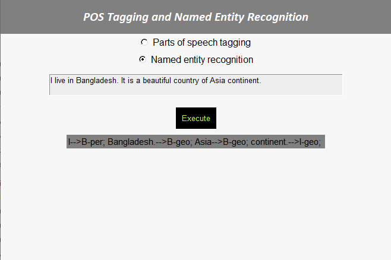

An autometed deep learning based application trained on ner_dataset that recognizes the parts of speech and named entity for each word of a given sentence.
run "pos_and_ner.py" to start the application

